# MyNote 笔记应用技术开发汇报

## 1. 项目概述

### 1.1 项目简介
MyNote 是一款面向个人用户的高效笔记管理应用，旨在提供简洁、安全、个性化的笔记记录和组织功能。用户可以创建、编辑、分类和搜索笔记，实现个人知识管理的数字化和智能化。

### 1.2 应用加载界面
应用启动时的加载界面，提供良好的用户体验：

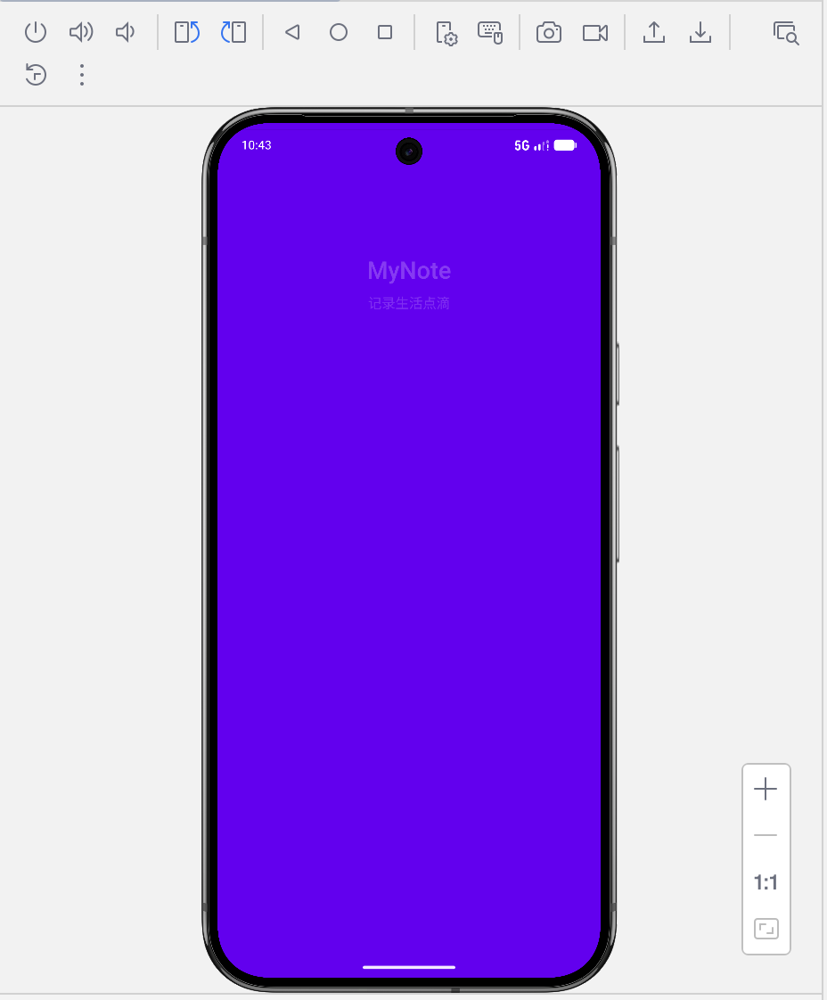

### 1.3 核心功能
- **用户认证系统**：支持用户注册、登录和身份验证
- **笔记管理**：创建、编辑、保存和删除笔记
- **标签系统**：为笔记添加标签，实现笔记的分类管理
- **搜索功能**：通过关键词搜索笔记
- **用户隔离**：确保每个用户只能访问自己的数据

## 2. 系统架构设计

### 2.1 整体架构
采用现代Android应用架构，遵循MVVM（Model-View-ViewModel）设计模式，实现关注点分离和代码的可维护性。

```
├── 表现层 (UI) - Activities/Fragments
├── 业务逻辑层 - ViewModels
├── 数据层 - Repositories
└── 数据源层 - DAOs/Database
```

### 2.2 技术栈
- **开发语言**：Kotlin
- **UI框架**：Android传统View系统
- **架构组件**：ViewModel、Coroutines、Flow
- **数据存储**：Room Database
- **数据持久化**：SharedPreferences
- **依赖注入**：自定义ServiceLocator

## 3. 核心模块实现

### 3.1 用户认证模块
#### 功能概述
实现用户的注册、登录和身份验证，确保应用数据的安全性和用户隔离。

#### 技术实现
- 使用Room Database存储用户信息
- 密码安全处理和验证
- 通过SharedPreferences保存当前登录用户ID
- 完整的用户会话管理

#### 用户界面展示
用户认证模块提供了直观的注册和登录界面：

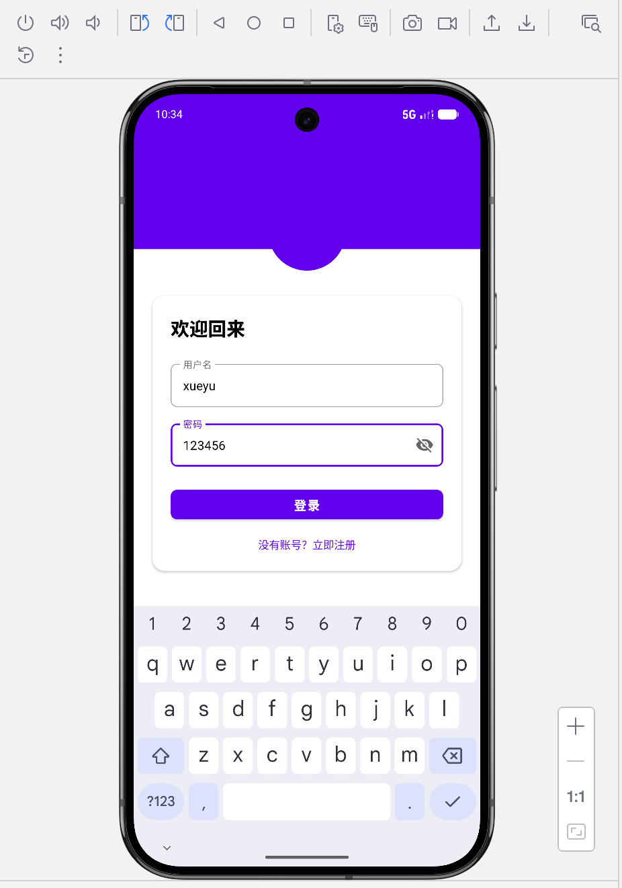

#### 关键类
- `LoginActivity`：处理用户登录逻辑
- `RegisterActivity`：处理用户注册流程
- `UserRepository`：管理用户数据的CRUD操作

### 3.2 笔记管理模块
#### 功能概述
提供笔记的创建、编辑、保存、删除和查询功能，是应用的核心业务模块。

#### 技术实现
- 使用Room DAO进行笔记数据的高效存取
- 实现用户隔离，确保数据安全性
- 支持按标签筛选和关键词搜索
- 自动管理笔记的创建和更新时间戳

#### 用户界面展示
笔记管理模块提供了直观的笔记列表和编辑界面：

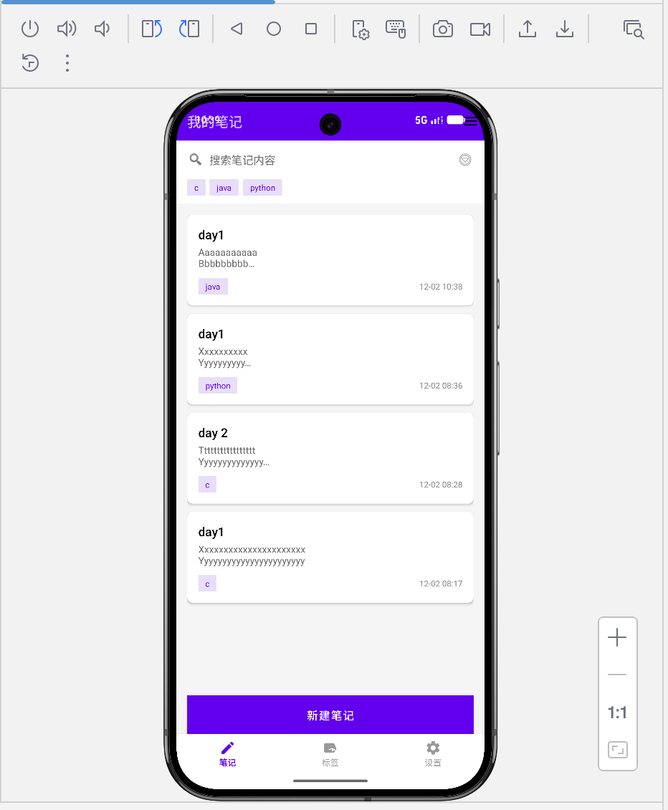
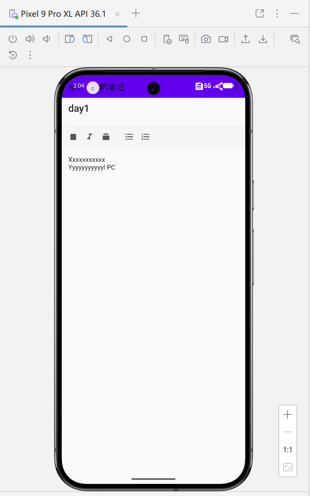
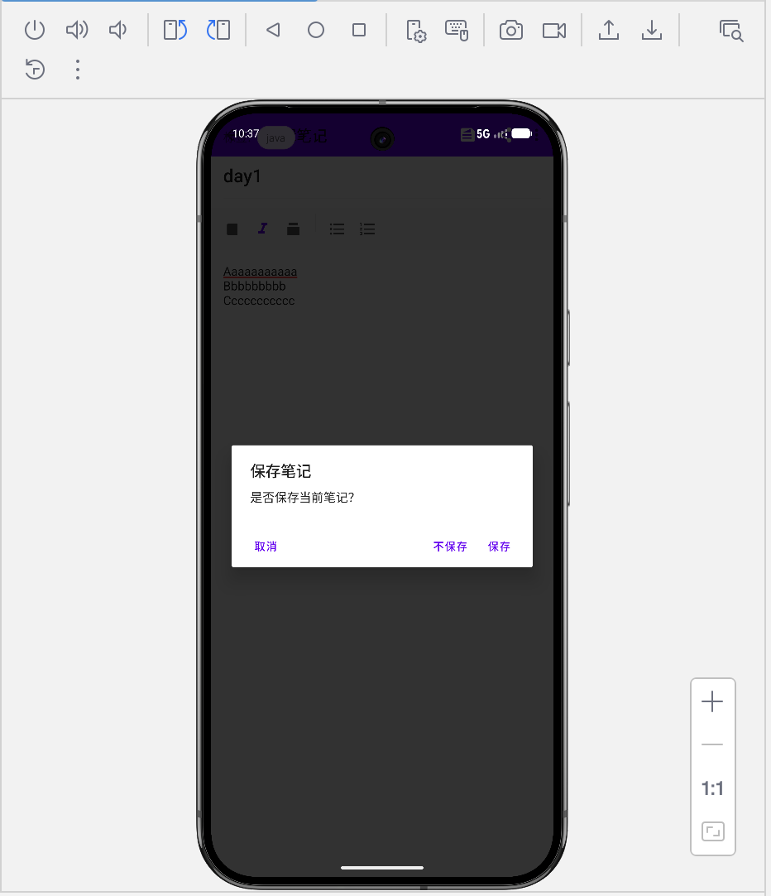

#### 关键代码示例

**NoteRepositoryImpl中的笔记保存实现：**
```kotlin
override suspend fun saveNote(note: Note) {
    // 确保使用当前用户ID，实现用户隔离
    val noteToSave = note.copy(userId = currentUserId)
    noteDao.insertNote(noteToSave)
}
```

**用户ID管理机制：**
```kotlin
// 从SharedPreferences获取当前登录用户ID
val sharedPreferences = getSharedPreferences("user_prefs", Context.MODE_PRIVATE)
val loggedInUserId = sharedPreferences.getLong("logged_in_user_id", 0L)
if (loggedInUserId > 0) {
    noteRepository.setCurrentUserId(loggedInUserId)
}
```

### 3.3 标签管理模块
#### 功能概述
实现标签的创建、管理和与笔记的关联，支持按标签筛选笔记。

#### 技术实现
- 标签与笔记的多对多关联设计
- 实时统计每个标签下的笔记数量
- 支持标签搜索和管理
- 标签颜色个性化展示

#### 用户界面展示
标签管理模块提供了完整的标签创建、管理和筛选功能：

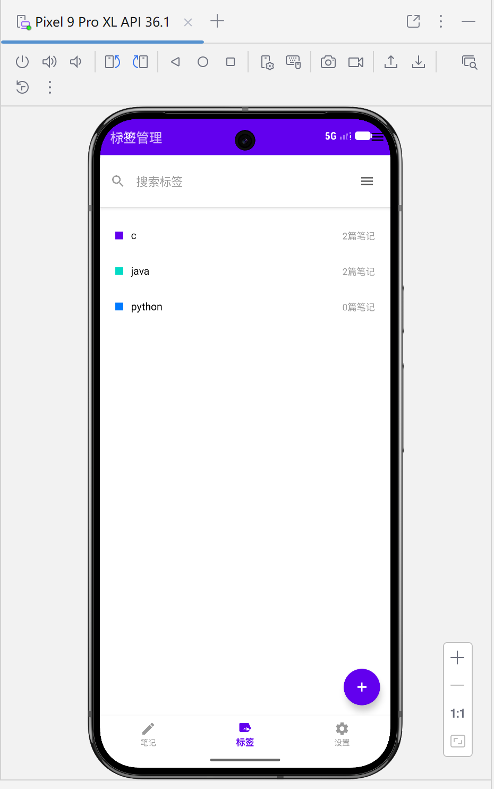
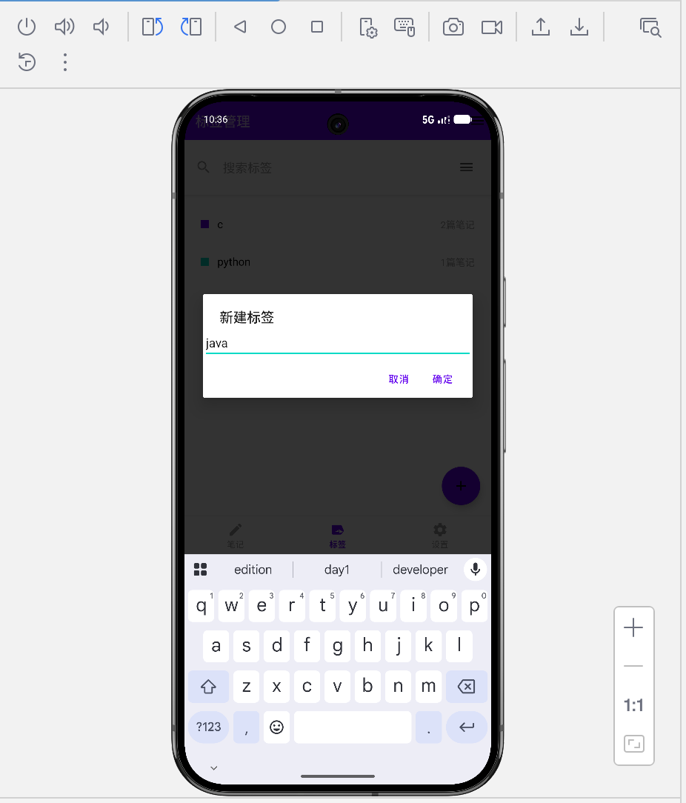
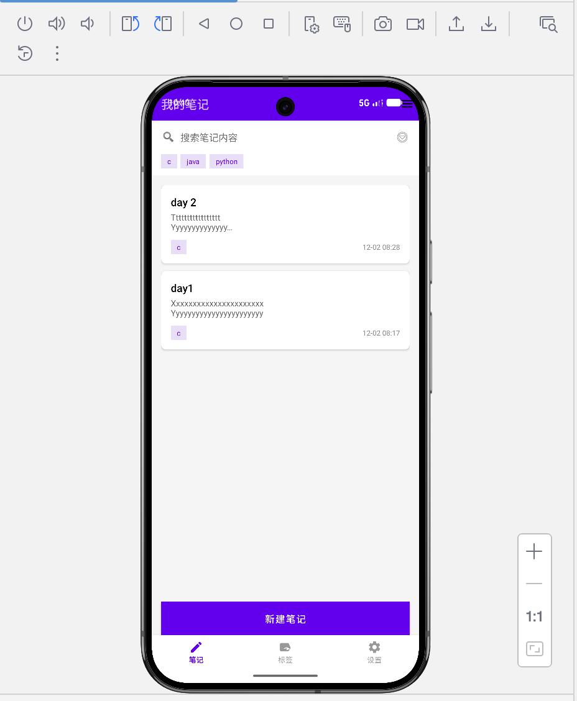

#### 关键实现细节

**标签笔记数量统计：**
```kotlin
// 为每个标签更新真实的笔记数量
lifecycleScope.launch(Dispatchers.IO) {
    val updatedTags = tags.map { tag ->
        // 获取该标签下的真实笔记数量，考虑用户隔离
        val realNoteCount = noteRepository.getNoteCountByTag(tag.tagId)
        // 创建更新了笔记数量的新标签对象
        tag.copy(noteCount = realNoteCount)
    }
}
```

## 4. 数据模型设计

### 4.1 数据库表结构

#### User表

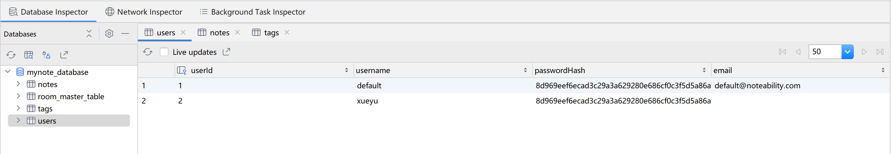

| 字段名 | 数据类型 | 描述 |
|-------|---------|------|
| userId | LONG | 用户ID（主键） |
| username | TEXT | 用户名 |
| password | TEXT | 密码（加密存储） |
| createdAt | LONG | 创建时间戳 |

#### Note表
| 字段名 | 数据类型 | 描述 |
|-------|---------|------|
| noteId | LONG | 笔记ID（主键） |
| userId | LONG | 用户ID（外键） |
| title | TEXT | 笔记标题 |
| content | TEXT | 笔记内容 |
| tagId | LONG | 标签ID（外键） |
| createdAt | LONG | 创建时间戳 |
| updatedAt | LONG | 更新时间戳 |

#### Tag表
| 字段名 | 数据类型 | 描述 |
|-------|---------|------|
| tagId | LONG | 标签ID（主键） |
| userId | LONG | 用户ID（外键） |
| name | TEXT | 标签名称 |
| color | INTEGER | 标签颜色 |
| createdAt | LONG | 创建时间戳 |

### 4.2 实体类关系
- **用户与笔记**：一对多关系，一个用户可以拥有多条笔记
- **用户与标签**：一对多关系，一个用户可以创建多个标签
- **标签与笔记**：一对多关系，一个标签可以关联多条笔记

## 5. 关键技术亮点

### 5.1 严格的用户隔离机制
实现了多层次的用户数据隔离策略，确保用户数据的安全性：

1. **Repository层隔离**：所有Repository实现都维护currentUserId状态
2. **查询条件过滤**：所有数据查询都包含用户ID过滤条件
3. **数据保存验证**：保存数据时自动关联当前用户ID
4. **SharedPreferences管理**：统一的用户会话管理机制

### 5.2 协程与Flow的异步数据处理
利用Kotlin协程和Flow实现高效的异步数据处理：

- 所有数据库操作在IO线程执行，避免阻塞主线程
- 使用Flow实现数据的响应式更新，UI自动反映数据变化
- 结构化并发确保任务的正确执行和取消

### 5.3 完整的错误处理与状态管理
- 实现了加载状态、错误状态和空状态的UI展示
- 数据库操作的异常捕获和处理
- 用户输入的验证和错误提示

## 6. UI/UX设计

### 6.1 界面设计
- 简洁明了的界面布局，符合Material Design设计原则
- 直观的导航结构，包括底部导航栏和标签管理入口
- 响应式设计，适配不同屏幕尺寸

### 6.2 搜索功能展示
应用提供强大的搜索功能，支持笔记内容和标签的模糊查询：

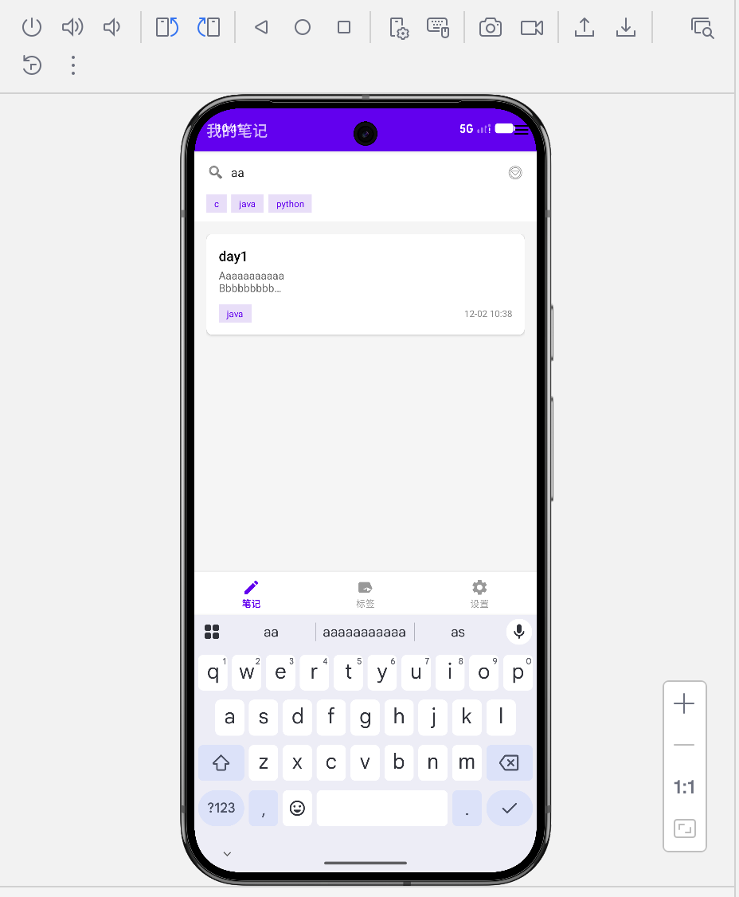
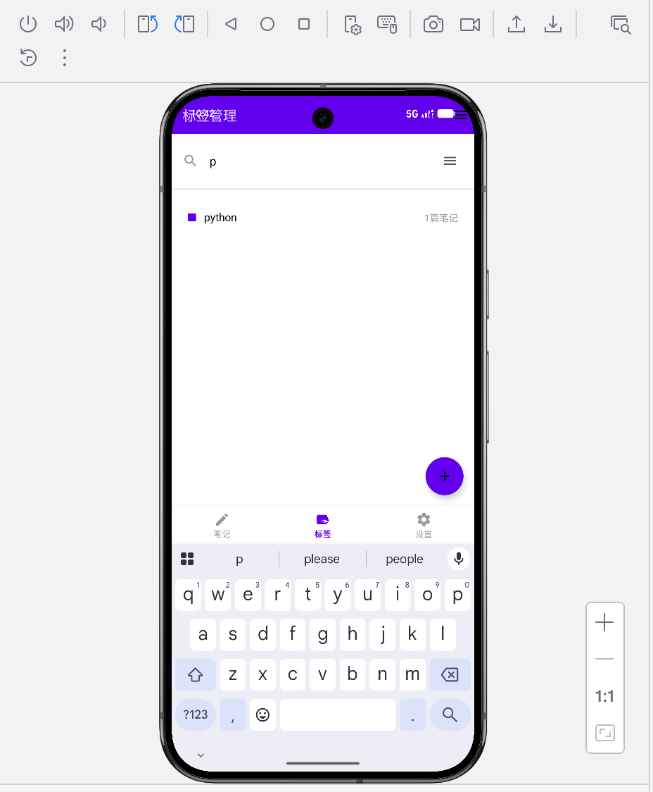

### 6.3 用户体验优化
- 实时数据同步和状态更新
- 流畅的交互动画和过渡效果
- 合理的错误提示和用户引导

## 7. 项目优化与未来规划

### 7.1 已完成的优化
- 修复了笔记保存时的用户ID硬编码问题
- 解决了标签笔记数量显示不正确的用户隔离问题
- 优化了Repository层的数据访问逻辑

### 7.2 未来功能规划
- **云同步**：添加笔记云同步功能，支持多设备数据一致
- **富文本编辑**：增强笔记编辑功能，支持富文本格式
- **AI辅助功能**：集成AI功能，提供智能笔记分析和整理
- **数据备份与恢复**：实现数据的导出、备份和恢复功能

## 8. 总结

MyNote应用目前已完成核心功能的开发，包括用户认证、笔记管理、标签系统等。应用采用了现代Android开发架构，实现了严格的用户数据隔离和安全机制。通过Kotlin协程和Flow等现代技术，确保了应用的性能和响应性。

项目遵循了软件工程的最佳实践，代码结构清晰，模块职责分明，为后续的功能扩展和维护奠定了良好的基础。未来将继续优化用户体验，增加更多实用功能，提升应用的竞争力和用户价值。